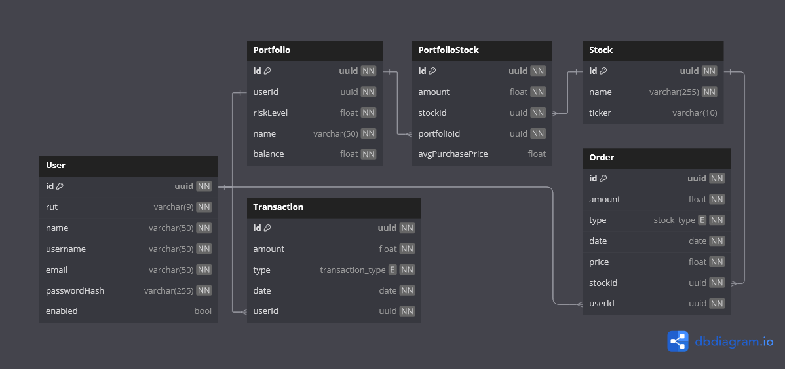

<p align="center">
  <a href="http://nestjs.com/" target="blank"></a>
</p>

[circleci-image]: https://img.shields.io/circleci/build/github/nestjs/nest/master?token=abc123def456
[circleci-url]: https://circleci.com/gh/nestjs/nest

  <p align="center">A progressive <a href="http://nodejs.org" target="_blank">Node.js</a> framework for building efficient and scalable server-side applications.</p>
    <p align="center">
<a href="https://www.npmjs.com/~nestjscore" target="_blank"></a>
<a href="https://www.npmjs.com/~nestjscore" target="_blank"></a>
<a href="https://www.npmjs.com/~nestjscore" target="_blank"></a>
<a href="https://circleci.com/gh/nestjs/nest" target="_blank"></a>
<a href="https://coveralls.io/github/nestjs/nest?branch=master" target="_blank"></a>
<a href="https://discord.gg/G7Qnnhy" target="_blank"></a>
<a href="https://opencollective.com/nest#backer" target="_blank"></a>
<a href="https://opencollective.com/nest#sponsor" target="_blank"></a>
  <a href="https://paypal.me/kamilmysliwiec" target="_blank"></a>
    <a href="https://opencollective.com/nest#sponsor"  target="_blank"></a>
  <a href="https://twitter.com/nestframework" target="_blank"></a>
</p>
  <!--[](https://opencollective.com/nest#backer)
  [](https://opencollective.com/nest#sponsor)-->

# 💼 Racional Test Backend

## Description

Este proyecto es una API REST desarrollada como parte de una prueba técnica para Racional, orientada a la gestión de inversiones en acciones. Permite a los usuarios autenticarse, registrar transacciones (depósitos y retiros), crear órdenes de compra y venta de acciones, y administrar portafolios personalizados. La documentación está disponible mediante Swagger para facilitar su exploración e integración.

Este proyecto:

- 🔧 Backend construido con NestJS
- 🐬 Base de datos MySQL
- 🛫 Migraciones automáticas con Flyway
- 📘 Documentación de la API con Swagger

## Contenidos

1. [Instrucción para levantar proyecto](#1-instrucciones-para-levantar-proyecto-con-docker-compose)

- 1.1. [Requisitos previos](#11-requisitos-previos)
- 1.2. [Instalación](#12-instalación)
- 1.3. [Configuración](#13-configuración)
- 1.4. [Ejecución](#14-ejecución)

2. [Documentación Swagger](#2-documentación-swagger)

3. [Modelo de datos](#3-modelo-de-datos)

- 3.1. [Descripción del modelo](#31-descripción-del-modelo)
- 3.2. [Relaciones entre entidades](#32-relaciones-entre-entidades)

4. [Documentación de rutas](#4-documentación-de-rutas)
5. [Contacto](#5-contacto)
6. [License](#6-license)

## 1. Instrucciones para levantar proyecto con Docker Compose

### 1.1. Requisitos previos

Antes de ejecutar el proyecto, asegúrate de tener instalados los siguientes componentes:

- Node.js >= v20.11.0
- NestJS CLI: npm install -g @nestjs/cli
- Docker: Para ejecutar el proyecto en contenedores
- Docker Compose: Para orquestar múltiples contenedores

### 1.2. Instalación

Para iniciar el proyecto, sigue estos pasos:

1. Clona el repositorio

```bash
git clone https://github.com/NicoleCG/racional-test-backend.git
```

2. Entra a la carpeta del proyecto

```bash
cd racional-test-backend
```

3. Instala las dependencias necesarias:

```bash
yarn install
```

### 1.3. Configuración

Dentro de la carpeta raíz del proyecto se debe crear un archivo `.env` con las siguientes variables de entorno:

```
NODE_VERSION=22.9.0-alpine3.19
DB_VERSION=8.0.39-debian
FLYWAY_VERSION=10.20.1-alpine

NEST_PORT=3000
DB_PORT=3306

DB_PASSWORD='my-password-123'
DB_NAME='racional_db'
DB_USERNAME=root
DB_HOST=mysql
DB_PATH='mysql'

JWT_SECRET='racional-123'

NODE_ENV=development
```

Cada una de las variables corresponde a lo siguiente:

- `NODE_VERSION` – Versión de Node.js
- `DB_VERSION` – Versión de MySQL
- `FLYWAY_VERSION` – Versión de Flyway
- `NEST_PORT` – Puerto donde corre la aplicación NestJS.
- `DB_PORT` – Puerto por defecto para conexiones MySQL.
- `DB_PASSWORD` – Contraseña para acceder a la base de datos.
- `DB_NAME` – Nombre de la base de datos principal.
- `DB_USERNAME` – Usuario administrador de la base de datos.
- `DB_HOST` – Host donde se encuentra el servicio de base de datos.
- `DB_PATH` – Ruta o nombre del contenedor/servicio de base de datos.
- `JWT_SECRET` – Clave secreta para firmar tokens JWT.
- `NODE_ENV` – Entorno de ejecución de la aplicación.

### 1.4. Ejecución

#### Desarrollo

1. Levantar contenedor de Docker con los servicios necesarios:

```bash
docker compose up -d
```

Este comando:

- Levanta la base de datos MySQL.
- Ejecuta las migraciones con Flyway desde la carpeta sql/.
- Inicia el servidor NestJS conectado a la base de datos.

## 2. Documentación Swagger

El proyecto incluye documentación automática de la API utilizando Swagger.
Una vez levantado el proyecto, puedes acceder a la documentación en tu navegador en:

```
http://localhost:3000/api
```

Desde allí podrás:

- Ver los endpoints disponibles
- Probar peticiones
- Revisar DTOs y esquemas de respuesta

## 3. Modelo de datos

Dentro de la carpeta [src/db](src/db/) es posible encontrar los siguientes elementos:

- `diagrams`: Carpeta con los diagramas de entidad-relación y diagrama conceptual del modelo de datos utilizado en el proyecto.
- `migrations`: Migraciones requeridas para construir la base de datos. Los datos ingresados son ficticios, y fueron creados para fines ilustrativos.
- `typeorm.config.ts`: Archivo TypeScript con la configuración de la conexión de la BD con TypeORM.

Respecto al modelado de datos en la siguiente figura se muestra el diagrama entidad-relación, ilustrando cada una de las tablas presentes en la base de datos así como sus atributos y tipología.



### 3.1. Descripción del modelo

Este modelo de datos representa una plataforma de inversión que permite a los usuarios gestionar transacciones monetarias, órdenes de compra/venta de acciones y portafolios de inversión.

#### 👤 Usuario (User)

La entidad principal es el usuario, identificado por un id único y caracterizado por atributos como rut, nombre, username, email, y passwordHash. Un usuario puede estar activo o inactivo mediante el campo enabled.

#### 💸 Transacciones (Transaction)

Cada transacción representa una entrada o salida de dinero del sistema. Puede ser de tipo deposit o withdrawal, está asociada a un usuario y contiene el monto y la fecha correspondiente.

#### 📈 Acciones (Stock)

Representa los instrumentos financieros (acciones) disponibles para operar. Incluye el nombre de la acción y su código bursátil (ticker).

#### 📑 Órdenes (Order)

Permite registrar operaciones de compra (buy) o venta (sell) de acciones por parte de un usuario. Cada orden está asociada a una acción específica y contiene el monto, tipo de operación, fecha y precio.

#### 📊 Portafolio (Portfolio)

Cada usuario posee un único portafolio, en el cual se almacena el nivel de riesgo asumido, un nombre descriptivo y el balance total disponible para invertir.

#### 📦 Composición del Portafolio (PortfolioStock)

Relaciona los portafolios con las acciones que contienen. Incluye la cantidad de acciones adquiridas, su precio promedio de compra y una referencia tanto al portafolio como a la acción correspondiente.

### 3.2. Relaciones entre entidades

Respecto a las relaciones entre las entidades del modelo:

- Un Usuario puede tener muchas Transacciones y muchas Órdenes.
- Un Usuario tiene un único Portafolio.
- Cada Orden está asociada a un Usuario y a una Acción (Stock).
- Un Portafolio puede contener múltiples Acciones a través de la tabla intermedia PortfolioStock.
- Cada PortfolioStock relaciona un Portafolio con una Acción, incluyendo la cantidad y el precio promedio de compra.

## 4. Documentación de rutas

⚠️ Todos los endpoints (excepto login y `/`) requieren autenticación mediante JWT en el header `Authorization: Bearer <token>`.

### 🔐 Autenticación

```
POST /auth/login
```

- Descripción: Inicia sesión con credenciales de usuario.
- Entrada (JSON):
  `{
  "username": "crivas",
  "password": "password1"
}`
- Salida (200 OK):
  `{
  "token": "jwt_token"
}`

### 👤 Usuarios

```
PATCH /users
```

- Modifica la información del usuario autenticado.
- Entrada (JSON):`
{
"name": "Juan Pérez",
"username": "jperez"
}`

- Salida: `200 OK – Información modificada correctamente`

### 💳 Transacciones

```
POST /transactions
```

- Descripción: Crea una transacción (depósito o retiro).
- Entrada (JSON): `{
  "amount": 1000,
  "type": "deposit" o "withdrawal"
}`
- Salida: `200 OK – Transacción creada correctamente`

### 🛒 Órdenes

```
POST /orders
```

- Descripción: Crea una orden de compra o venta de acciones.
- Entrada (JSON): `{
"amount": 5,
"type": "buy" o "sell"
"price": 15.5,
"stockTicker": "AAPL"
}`
- Salida: `200 OK – Orden creada correctamente`

### 📊 Portafolio

```
PATCH /portfolios
```

- Descripción: Modifica el nombre y nivel de riesgo del portafolio.
- Entrada (JSON): `
{
  "riskLevel": 5,
  "name": "Portafolio de Juan Pérez"
}`

- Salida: `200 OK – Portafolio actualizado correctamente`

---

```
GET /portfolios/value
```

- Descripción: Obtiene el saldo y valor total del portafolio.
- Salida: `200 OK – Información de balance del portafolio`

---

```
GET /portfolios/movements?limit=10
```

- Descripción: Obtiene los últimos movimientos del portafolio.
- Parámetro opcional: `limit` (número de movimientos)
- Salida: `200 OK – Lista de movimientos recientes`

### 🛠️ Otros

```
GET /
```

Devuelve un mensaje de prueba (Hello World).

## 5. Contacto

**Nicole Carvajal**\
Email: nicole.carvajalg@gmail.com\
GitHub: [NicoleCG](https://github.com/NicoleCG)

## 6. License

Nest is [MIT licensed](LICENSE).
